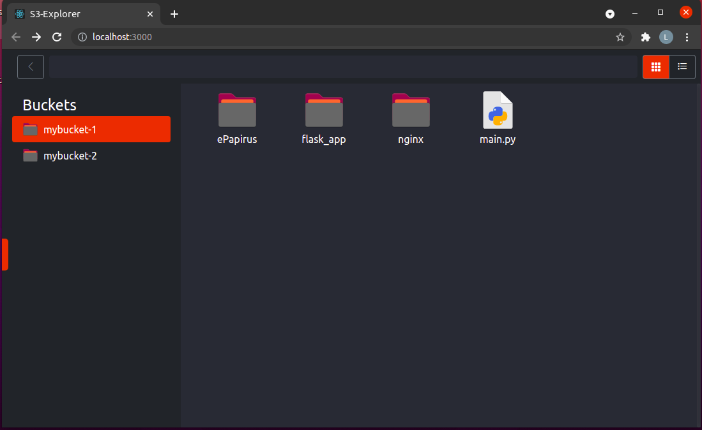

# Objetivo
---
Ser uma aplicação de visualização e download de arquivos de buckets s3 da aws



# Como utilizar
---
Tem duas maneiras, utilizando a [imagem](https://hub.docker.com/r/lucasfdutra/s3-explorer) já pronta no dockerHub ou então fazendo o build do projeto

## Utilizando Docker
Crie um arquivo de configurações para o aplicativo react, que irá indicar o endereço que seu backend flask está.

```js
var API_URL = "http://meu-servidor-flask.com:8000"
```

Agora crie o docker-compose.yml, com o volume passando esse seu arquivo `config.js` para o lugar do arquivo de configurações já existente no container. E também, você deve passar as credenciais da aws no formato de variáveis de ambiente, sendo que se você quiser utilizar algo como o localstack, você pode, é só colocar qualquer credencial para as variáveis aws e definir o `ENDPOINT_URL` com o ip da sua máquina na rede interna, como o exemplo abaixo. Mas caso queira utilizar a aws de verdade, você não precisa passar o `ENDPOINT_URL`.

```yml
version: "3"

services: 
    s3-explorer:
        build: .
        restart: always
        environment:
            - AWS_ACCESS_KEY_ID=123
            - AWS_SECRET_ACCESS_KEY=123
            - ENDPOINT_URL=http://192.168.0.108:4566
        ports:
            - "80:80"
            - "8000:5000"
        volumes:
            - "./config.js:/usr/share/nginx/html/config.js"
```

## Permissões
O user IAM que será o dono das credenciais, deve possuir permissõa para as seguintes execuções da sdk boto3
- list_buckets
- list_objects_v2
- generate_presigned_url

Se tiver duvidas quanto as permissões, veja melhor no tópico de [Estrutura do Projeto](#estrutura-do-projeto) o porque elas são necessárias

## Fazer o Build do Projeto:
Você vai precisar criar o build da aplicação react e alocá-la onde achar melhor.
```sh
npm run build
```

E quanto a aplicação python, você apenas precisa garantir que as variáveis de ambient `AWS_ACCESS_KEY_ID` e `AWS_SECRET_ACCESS_KEY` existam.
E caso queira, eu já deixei comentado no arquivo `main.py` a parte que importo a lib `python-dotenv` e a utilizo para carregar um arquivo `.env` com as credenciais, ou seja, é só descomentar essa parte e adicionar um arquivo `.env` com as variáveis.

E uma vez como essa questão resolvida, você pode escolher como irá publicar essa aplicação, caso queira utilizar o uwsgi como eu, e o nginx como web server, eu recomendo dar uma lida nesse post da [digitalocean](https://www.digitalocean.com/community/tutorials/how-to-serve-flask-applications-with-uswgi-and-nginx-on-ubuntu-18-04-pt).

Mas se quiser utilizar, eu já deixei dentro da pasta nginx o arquivo s3-explorer-api.conf que contém as configurações para ser o servidor web do meu projeto dentro de um container, e também deixei o arquivo app.ini dentro da pasta backend.

# Estrutura do Projeto
---
O projeto utiliza 4 tecnologias. Docker, Nginx, React e Python/Flask.

O container utilizado foi o container do nginx, o qual passou por algumas costumizações. Eu instalei o python dentro do container, e as libs necessárias para o projeto. Enviei para dentro desse container os arquivos do backend, sendo eles o codigo python que é uma api flask, que interagem com o frontend e com o s3 por meio da sdk da aws, e o arquivo app.ini, responsável por configurar o uwsgi. Também enviei os arquivos html, js, css do projeto react (build do projeto) e os arquivos de configuração do nginx.

O nginx é responsável por ouvir as portas 80 e 5000, sendo que se uma requisição chegar pela porta 80 ela é destinada a aplicação react, ou seja, a porta 80 é destinada a servir o frontend. Já a porta 5000 é para o backend, que se comunica com o nginx por meio do protocolo de socket com o uwsgi.


## Funcionalidades
- Listar os buckets da conta
- Listar os objetos de um dado bucket
- Efetuar o download do objeto
    - O download é feito da seguinte forma: No momento em que um arquivo recebe um duplo click no frontend, o backend utiliza a sdk, e gera um link pré-assinado, somente para esse arquivo, com duração de apenas 2 segundos. Ou seja, por dois segundos, o objeto que quer efetuar o download recebe uma URL pública, sendo tempo suficiente apenas para que a url saia do backend, chegue no frontend e então começe a efetuar o download, ou seja, tempo suficiente apenas para que o frontend consiga fazer a conexão TCP com o servidor da aws (dois segundos pode ser muito, mas estou pensando também em casos de uso de internets mais lentas, mas estou considerando deixar esse parâmetro mais facilmente configurável por variável de ambiente). Depois disso a url não fica mais válida (caso o arquivo seja grande ao ponto de levar mais que dois segundos para baixar, não tem problema, pois a conexão já existe, então o download irá terminar normalmente, porém não é possível utilizar a mesma URL para tentar baixar novamente). Recomendo dar uma lida [nesse artigo](https://docs.aws.amazon.com/pt_br/AmazonS3/latest/userguide/ShareObjectPreSignedURL.html) da aws sobre as urls pré-assinadas. `Mas veja bem, se essa abordagem de deixar seus arquivos públicos por um instante que seja, não é bem vista, você pode limitar o acesso por meio de permissões na aws, ou então não utilize esse ferramenta, ou pelo menos não faça downloads com ela, só utilize para visualizar`.


# IMPORTANTE
O Tema de icones que utilizei foi retirado do projeto [papirus](https://github.com/PapirusDevelopmentTeam/papirus-icon-theme/), eu peguei alguns icones específicos que eu gostei, e achei que ficaram legais com meu projeto. O download foi efetuado pelo [gnome-look.org](https://www.gnome-look.org/p/1166289/), e então copiei os .svg e coloquei dentro da pasta `frontend/src/icons`.
